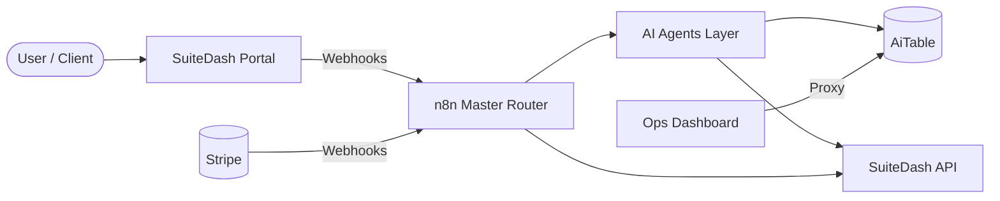

# Dynasty Empire — SuiteDash Deployment System

Multi-niche directory business factory. 16 niches, 7 AI agents, 9 n8n workflows, 12 AiTable tables, operations dashboard.

## Architecture



## Credentials layout

See **`docs/CREDENTIALS_INVENTORY.md`** for which services map to which `.env` keys (no secrets in repo).

## Go-live (clients & revenue)

See **`GO_LIVE_CHECKLIST.md`** — env verification commands, first-niche rollout, production hygiene, and a **client-facing SOW template**.

## Cursor (agent autonomy)

Workspace root **`AGENTS.md`**, **`.cursor/rules/*.mdc`**, and **`docs/CURSOR_OPTIMIZATION.md`** (MCP starter + external references).

## Quick Start

1. Clone this repo  
2. `npm install`  
3. Copy `env/.env.example` to `.env` at the project root and fill from your vault (or keep using `env/.env`)  
4. `cd dashboard && npm install && cd ..`  
5. Run tests: `npm test`  
6. Strict integration gate (CI): `npm run test:api:strict` — requires Tier A env vars; fails on any dead integration.  
7. Start dashboard: `npm run dashboard:dev` (serves static UI + API proxy on port 3000; **`GET /api/health`** for env readiness)  
8. Preflight dashboard deps + syntax: `npm run dashboard:build`

## File Structure

| Path | Purpose |
|------|---------|
| `agents/` | Node agent modules (lead scoring, comms, orchestrator, QA, etc.) |
| `n8n/` | Importable n8n workflow JSON (packs 01–09) |
| `scripts/` | Setup, verify, deploy, n8n import, emergency stop |
| `suitedash/` | Niche JSON configs, onboarding flow template |
| `dashboard/` | Static `index.html` + Express `server.js` proxy for AiTable |
| `data/` | CSV import templates (12 tables) |
| `tests/` | Workflow JSON, niche config, agent, and connection tests |

## Deploy a Niche

```bash
node scripts/deploy-niche.js plumbing
```

## Emergency Stop

```bash
node scripts/emergency-stop.js pause
node scripts/emergency-stop.js resume
node scripts/emergency-stop.js status
```

The dashboard also exposes **Emergency: Active/Paused** and POST `/api/emergency-stop` when `npm run dashboard:dev` is running.

## 16 Niches (deployment order)

1. Plumbing — Pack 1  
2. HVAC — Pack 2  
3. Pest Control — Pack 3  
4. Roofing — Pack 4  
5. Real Estate — Pack 5  
6. Property Management — Pack 6  
7. Immigration Legal — Pack 7  
8. Tax & Accounting — Pack 8  
9. Medical Billing — Pack 9  
10. Home Cleaning — Pack 10  
11. Landscaping — Pack 11  
12. Auto Repair — Pack 12  
13. Childcare — Pack 13  
14. Fitness Coaches — Pack 14  
15. Digital Marketing — Pack 15  
16. Construction — Pack 16  

## API Reference (patterns used)

- **SuiteDash** — `GET/POST https://…/secure-api/...` with headers **`X-Public-ID`** (`SUITEDASH_API_ID`) and **`X-Secret-Key`** (`SUITEDASH_API_SECRET`) per [Secure API](https://help.suitedash.com/article/550-secure-api). (Not `X-API-KEY`.)  
- **AiTable** — `GET/POST/PATCH https://aitable.ai/fusion/v1/datasheets/{TABLE_ID}/records` with `Authorization: Bearer {AITABLE_API_KEY}`.  
- **n8n** — REST `GET/POST {N8N_BASE_URL}/api/v1/...` with `X-N8N-API-KEY` plus Cloudflare Access client id/secret when applicable. Webhooks live under `N8N_WEBHOOK_BASE`.

See `.cursorrules` for rate limits, naming conventions, and guardrails.
